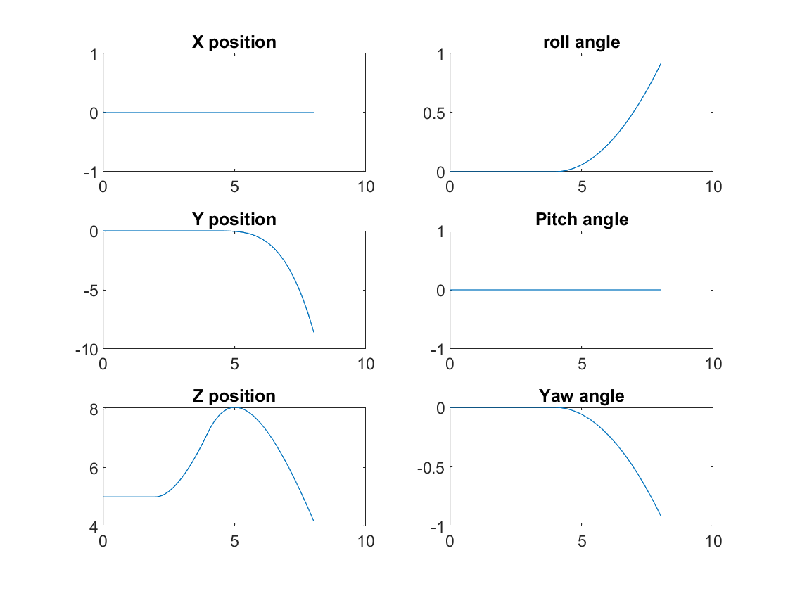
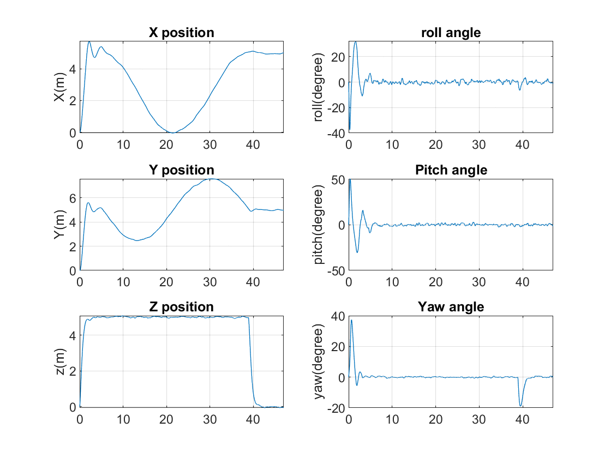

# Quadcopter-Dynamics-Simulation
This repository contains code for quadcopter control simulation. We implemented an approximated dynamic model to control a quadcopter drone. It is demonstrated in simulation in MATLAB

<table>
  <tr>
    <th>Quadcopter lifts and drop</th>
    <th>quadcopter dynamics</th>
  </tr>
  <tr>
    <td style="vertical-align: top;">
      
    </td>
      <td style="vertical-align: top;"> 
        
    </td>
  </tr>
</table>

<table>
  <tr>
    <th>Quadcopter lifts and moves in circle</th>
    <th>quadcopter dynamics</th>
  </tr>
  <tr>
    <td style="vertical-align: top;">
      
    </td>
      <td style="vertical-align: top;"> 
        
    </td>
  </tr>
</table>

the codes of three questions are in Question 1, Question 2, Question 3 respectively.
In question 2, please remember to run robotcontrol_2a.m before running quadcopter_script_2b.m
In question 3, please remember to run robotcontrol_2a.m before running quadcopter_script_3a.m or quadcopter_script_3b.m
